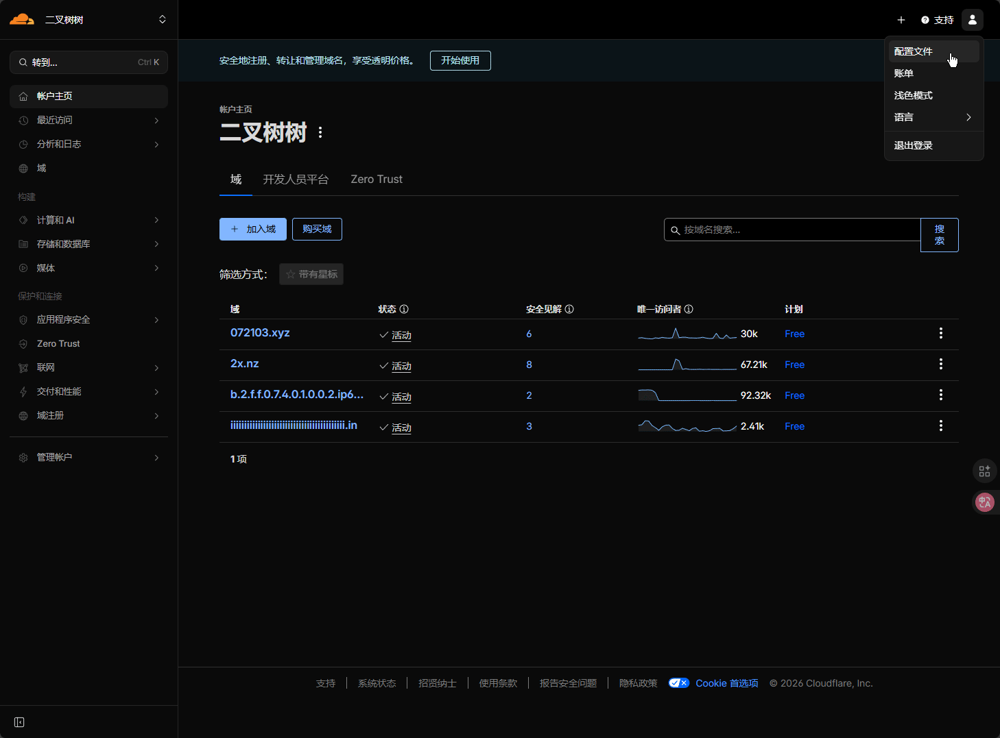

# 从KV迁移
由于原项目于26/1/3将数据存储从KV迁移到了D1，并且配备了完备的i18n，如果你仍在运营旧版的UptimeFlare，建议升级，下面是迁移教程

首先，将你之前配置的Cloudflare API令牌添加一个新的权限 **编辑D1**

然后备份根目录的 `uptime.config.ts` ，直接 把原仓库删了（但是不要删KV，Worker，Page），Fork我的仓库

::github{repo="afoim/UptimeFlare"}

接下来编辑新的 `uptime.config.ts`

参阅 [UptimeFlare/uptime.config.ts at main · afoim/UptimeFlare](https://github.com/afoim/UptimeFlare/blob/main/uptime.config.ts) 主要就是将自定义callback迁移到官方的WebHook方法

编辑后推送，会自动触发Github Action的自动部署，它会自动将KV内的数据迁移到D1

这迁移到D1何意味


# 前言
本来这个教程应该是永远都不会出的，因为在此之前，我曾经给大家介绍了一个无需自托管的监控服务：[UptimeRobot](/posts/uptimerobot/) 

但是，就在最近我再次查看控制台，发现之前创建的监控全部都没了，咱也不知道是被官方删了还是号被黑客大手子肘击了，总之，我现在不得不要重建监控服务了

# 原理
首先，UptimeFlare是一个基于Cloudflare Worker+D1的监控服务

它的原理非常简单，一共由三个部分组成
- **前端**：放在Cloudflare Page，用于给用户展示zhandianzhuangt
- **后端**：放在Cloudflare Worker，通过 Worker 自带的 **Cron** 每分钟 检查站点状态，并将状态持久化进 **D1** 


# 正式开始
首先我们需要 **Fork** 项目，建议Fork我的项目（由于原项目不知道为什么不给在某些地方注入环境变量，所以建议Fork我的）

::github{repo="afoim/UptimeFlare"}

首先，我们先尝试将其部署到Cloudflare

创建一个Cloudflare API Token **编辑Workers** 和 **D1** 


接下来将该Token绑定到你的Github仓库


最后，来到 `Action` 页面，手动创建一个 `Deploy to Cloudflare` 的工作流


等待工作流运行结束，你应该可以在Cloudflare仪表板看见一个新的Page，新的Worker和新的D1


点开 Page，注意不要点错了


绑定你的域名，尝试访问


如果你能看到一个初始的监控页面，则正常


接下来，我们开始自定义该监控

编辑根目录的 `uptime.config.ts` 

如果服务故障如何做通知？

UptimeFlare非常自由，你可以在 `callbacks` 中编写故障时要做的任何事情，这里以发送 `POST` 请求让 `Resend` 发送邮件给你举例

首先前往 https://resend.com/

添加一个域名（作为你的发信域名）


创建一个发信API Key


添加环境变量： `RESEND_API_KEY` 将其绑定到 **Action**


编辑 `uptime.config.ts` 的 `webhook.payload` 部分

示例代码：
```ts
        payload: {
        "from": "系统状态更新 <uptimeflare@update.2x.nz>",
        "to": ["acofork@foxmail.com"],
        "subject": "UptimeFlare 状态更新",
        "text": "$MSG"
      },
```

接下来，当服务故障/重新上线就会通知你啦~


最终效果：
::url{href="https://ok.2x.nz"}